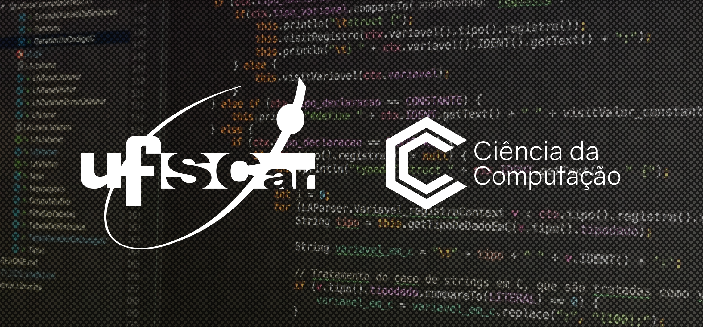

# MLlib Spark - Jupyter Notebooks

<a href="http://bcc.dc.ufscar.br/" target="_blank">
<figure>

<figcaption>Bacharelado em Ciência da Computação (BCC) - UFSCar</figcaption>
</figure>
</a>

Este projeto está dividido em alguns notebooks para que possam ser executados de forma unitária. Você pode abrí-los pelo GitHub mesmo caso queira apenas visualizá-los, ou utilizar o link a seguir para abrir no Colab e executar em um ambiente em nuvem:

## Índice

- [Contexualização do assunto](./contexto.md)
- Classificação
  - [Implementação Básica](./classificacao.ipynb)
  - [Implementação Completa](#wip)
  - [Comparação com outras bibliotecas](#wip)
- Clusterização
  - [Implementação Básica](./clusterizacao.ipynb)
  - [Implementação Completa](#wip)
  - [Comparação com outras bibliotecas](#wip)
- [Conclusão](#wip)

## Autores

- **Alisson Nunes** (725862)
- **Lucas Mathaeus** (726561)
- **William Eugênio** (726601)

## Curso

- Processamento de Dados em Escala
  - Prof. Dr. Anderson C. Carniel
- Bacharelado em Ciência da Computação (BCC)
- Departamento de Computação (DC)
- Universidade Federal de São Carlos (UFSCar)