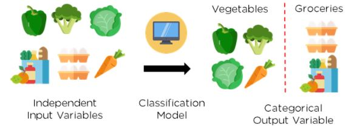

# Aprendizado de Máquina (Machine Learning - ML)

- .
- .

## Categorias

- .

### Classificação

Modelo supervisionado que é utilizado para dizer a qual classe um objeto ou dado pertence, e pode ser usado para classificar imagens, por exemplo.

### Clusterização

Modelo não supervisionado que são utilizados para criar agrupamentos “escondidos” nos dados, por exemplo, agrupar filmes por gênero, clientes por comportamento de compra (tipo de produto, por exemplo), pessoas usuárias por estilo musical. É utilizado para criar sistemas de recomendação de serviços de streaming de música ou séries, por exemplo.

# Processamento Paralelo e Distribuído (PDD)

## Resilient Distributed Dataset (RDD)